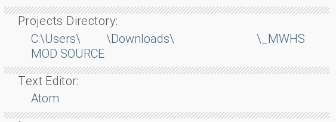

# Overview

MochiMod is a mod loader specifically made for <a href="https://not-fun-games.itch.io/metaware-high-school">MetaWare High School (Demo)</a>.

***

### You will need the following.
If you just want to use the launcher, and have no intention of modding the game, you'll only need to download a fresh copy of MetaWare.

* Unmodified copy of <a href="https://not-fun-games.itch.io/metaware-high-school">MetaWare High School (Demo)</a>

If you'd like to create modpacks, you will need to download two extra programs, as well as the [modpack template](.github/zips/ModpackTemplate.zip) from MochiMod's GitHub repository.

* [Ren'Py 7.2.2](https://www.renpy.org/release/7.2.2)
* [RPA Extract](https://iwanplays.itch.io/rpaex)

***

	
Launcher Configuration

	<h1> Step 1 </h1>
	
Download MetaWare and unzip the game as you would normally. Download MochiMod and extract the ZIP to your desktop.  
	
	<h1> Step 2 </h1>
	
Open MochiMod.exe. Once the launcher is running click on the bottom-most button labeled "Settings", and paste in the directory of your unmodded MetaWare copy. <b>After</b> you do this, press enter and click the button on the above prompt.  
	
	<h1> Step 3 </h1>
	
Check the root directory of your MetaWare copy (The folder with <code>MetaWareHighSchoolDemo.exe</code> inside). There should now be a folder named <code>mods</code> which you can move modpacks into.  
	

***

Making a Modpack

<h1> Step 1</h1>

Install Ren'Py for your system as you would normally, then choose a location to unzip your copy of MetaWare to. <b>This should be a different copy than the one you're using for your launcher.</b> For the sake of this tutorial, I created a folder named
<code>_MWHS MOD SOURCE</code> in the root directory of my Ren'Py copy and moved MetaWare into it.  

<h1> Step 2</h1>

Open Ren'Py and click the preferences text down by the Launch Project button, and set your projects directory to the folder your copy of MetaWare is in (<code>_MWHS MOD SOURCE</code> in my case). You can set your text editor to whatever you'd like, but I chose Atom. We'll come back to Ren'Py in a bit.  

<h1> Step 3</h1>

Download RPA Extract and move it to the game directory of your modded MetaWare copy. After you do this, you'll want to drag each .rpa file onto rpaExtract.exe to decompress it and free those sweet sweet game files. If your antivirus flags RPA Extract as a virus, whitelist the .exe file.

After you do this, delete the three .rpa files you have left over, as well as rpaExtract.exe.  

<h1> Step 4</h1>

Go back to Ren'Py and click the refresh button near the projects list on the left if MetaWare High School (Demo) isn't appearing in the projects list. If it <i>is</i>, good job for making it this far! You can now modify this copy of MetaWare however much you'd like before proceeding to Step 5.  

It was the first thing that came to mind, so I replaced all of the character icon with Nathaniel Bandy's PFP. I'm sorry.  

<h1> Step 5</h1>

After you've made your mod, you're ready to recompile the game. Go back into Ren'Py and click "Build Distributions". It should be in the bottom right, in the row above the launch project button. Ren'Py will scan the project, and then you'll need to select an operating system to build your game for. You can select any option, as you'll only need the .rpa files from the final build.

Click build and let Ren'Py compile the game.  

<h1> Step 6</h1>

Once the game is done building, the directory containing the zip of your game should pop up. If it doesn't, don't worry, just navigate to the project folder you set earlier. Unzip the game, and run it make sure everything works. If everything looks the way you want it to, you're ready to finally make your modpack.

Download the modpack template, unzip it and move it to your launcher build's <code>mods</code> folder. Then, navigate to the game directory of the build you just made. You should see three .rpa files, like the ones we extracted the game's assets from earlier. Move these .rpa files, as well as the <code>scripts</code> folder into your modpack.

   

You can edit <code>_info.json</code> and <code>_icon.png</code> from here to add information about your mod and customize its appearance in the launcher.  

<h1> Step 7</h1>

Open MochiMod. Once the mod list refreshes, you should see your modpack. Click the mod to select it, then hit Play, and give it a shot!  

***
